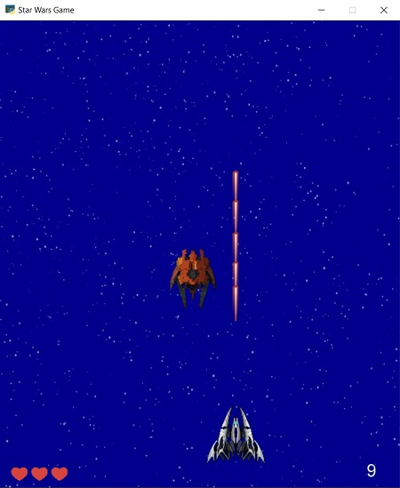
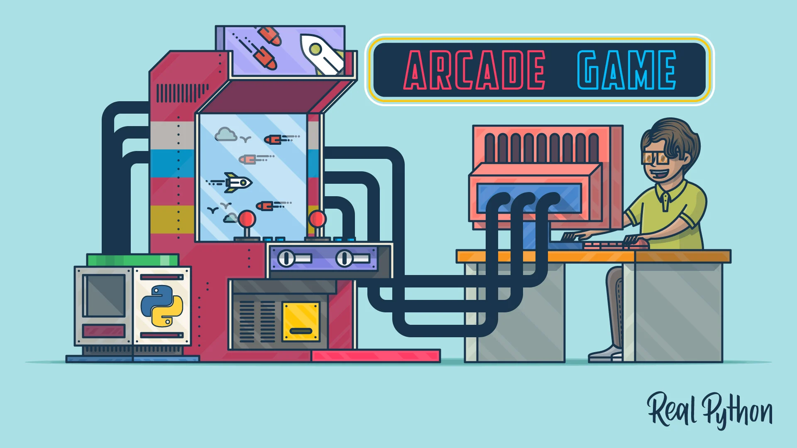

# Star Wars 💥🎮

**Star Wars** is a simple entertaining game which is in the category of Shooter games. In this game you have to defend your planet against alien invasion.
---
## Game Rules
At the beginning of the game you have three lives. Each time invaders enter your planet, one life will be lost. If this happens three times, the game will be over. Remember that you also lose if you hit the attackers' spaceships. You can shoot at the attackers to defend yourself and destroy them. The more invaders you destroy, the more scores you get.



---
## Key Functions
|Key on Keyboard|Function|
|-|-------------------------|
|A or Left Arrow|move to the left|
|D or Right Arrow|move to the right|
|Space|shoot|

---
## Python
This program is written using Python language and [arcade](https://api.arcade.academy/en/latest/) which is an easy-to-learn Python library for creating 2D video games.




## Usage
Install required libraries:
```
pip install arcade
```
then run the program:
```
python main.py
```