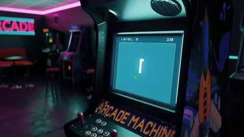
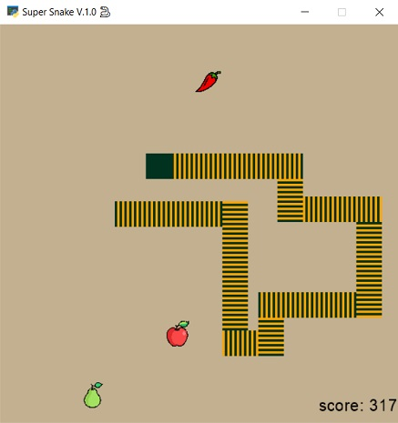

# Super Snake V.1.0 🐍

**Super Snake V.1.0** is an entertaining simple single-player game. This 2D game is a sub-genre of action video games. In this game the player maneuvers the end of a growing snake. In addition to the primary game, here another type of **Super Snake powered by AI** is presented in a separate python file.



---
## Game Rules
The player must keep the snake from colliding with both game borders and itself, which gets harder as the snake lengthens. Using the arrow keys, the player can maneuver the snake to eat three type of fruits including apple, pear and chili. The mentioned fruits have different scores in such a way that eating apple and pear, has 1 and 2 scores and lengthens the snake as much as 1 and 2 units respectively. The player must avoid eating chili because eating it has a minus point. If the score drops to zero, the game is over.



---
## Super Snake powered by AI
**Super Snake powered by AI** provides a different type of the game. In this version, without human intervention, the snake will automatically move towards the fruits with positive score (i.e. apple and pear). **Another capability of this version is the comparison of the distance between the snake and any of the two fruits**, so that between apple and pear, it moves towards one that has a smaller distance to the snake. If the distances are the same, the snake chooses the fruit that has more score (i.e. pear).

## Key Functions
|Key on Keyboard|Function|
|-|-------------------------|
|Left Arrow|move to the left|
|Right Arrow|move to the right|
|Up Arrow|move up|
|Down Arrow|move down|

---
## Python
This program is written using Python language and [arcade](https://api.arcade.academy/en/latest/) which is an easy-to-learn Python library for creating 2D video games.


## Usage
Install required libraries:
```
pip install arcade
```
then run the program:
```
python main.py
```
or run the Super Snake powered by AI:
```
python main_ai.py