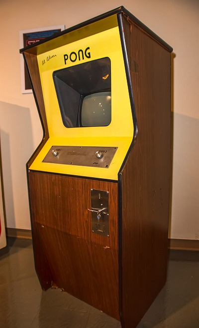

# Pong 2024 🏓

**Pong 2024** is a two-dimensional sports game that simulates table tennis.


---
## Pong History
**Pong** is a table tennis–themed twitch arcade sports video game, featuring simple two-dimensional graphics, manufactured by Atari and originally released on 29 November 1972. It was one of the earliest arcade video games; it was created by Allan Alcorn as a training exercise assigned to him by Atari co-founder Nolan Bushnell, but Bushnell and Atari co-founder Ted Dabney were surprised by the quality of Alcorn's work and decided to manufacture the game. Bushnell based the game's concept on an electronic ping-pong game included in the Magnavox Odyssey, the first home video game console. In response, Magnavox later sued Atari for patent infringement.



Pong was the first commercially successful video game, and it helped to establish the video game industry along with the Magnavox Odyssey. Soon after its release, several companies began producing games that closely mimicked its gameplay. Eventually, Atari's competitors released new types of video games that deviated from Pong's original format to varying degrees, and this, in turn, led Atari to encourage its staff to move beyond Pong and produce more innovative games themselves.

---
## Pong 2024 Game Rules
The player controls an in-game paddle by moving it vertically across the left side of the screen. They compete against another player powered by AI controlling a second paddle on the opposing side. Players use the paddles to hit a ball back and forth. Points are earned when one fails to return the ball to the other and the ball leaves the edge of the playfield.

## Key Functions
|Mouse|Function|
|-|-----------------|
|Mouse Movement to Up and Down|moving paddle up and down|

---
## Python
This program is written using Python language and [arcade](https://api.arcade.academy/en/latest/) which is an easy-to-learn Python library for creating 2D video games.


## Usage
Install required libraries:
```
pip install arcade
```
then run the program:
```
python main.py
```